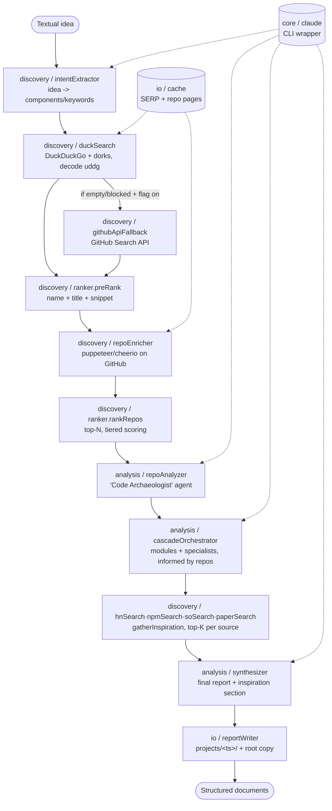
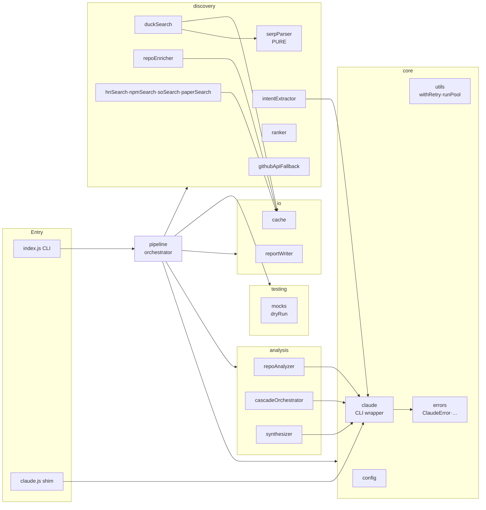

# Architecture - GitResearcher

A Node.js (ESM) tool that turns a textual idea into a set of analysis documents, discovering real
GitHub repositories (via DuckDuckGo + dorks) and analyzing them with specialized Claude agents in a
cascade. Diagrams in [Mermaid](https://mermaid.js.org/) (rendered on GitHub).

## 1. End-to-end pipeline

Each phase is isolated: a non-fatal failure saves partials and continues
(`fail non-fatal + save partial` philosophy). `dryRun` injects DI mocks across the whole chain
-> no real calls to Claude/DuckDuckGo/GitHub.

## 2. Package organization

**Dependencies point downward** (arrows go from consumers to providers):
`entry -> pipeline -> {core, discovery, analysis, io, testing}`. `core` does not depend on any other
package (foundation). No module imports from `index.js` (no cycles).

## 3. Key contracts (dependency injection)

All modules with I/O accept a `deps = {}` with real defaults; in `dryRun`/tests the pipeline injects
mocks -> testability without network and without mocking ESM.

| Module | Signature (deps) |
|---|---|
| `duckSearch.searchRepos` | `{ fetchImpl?, parseResults?, cache? }` |
| `repoEnricher.enrichRepos` | `{ getPage?, cache? }` |
| `repoAnalyzer.analyzeRepo` | `{ runClaude?, fetchIssues? }` |
| `cascadeOrchestrator.runCascade` | `{ runClaude?, runClaudeJSONWithRetry? }` |
| `discovery/hnSearch·npmSearch·soSearch·paperSearch` | `{ fetchImpl?, topK?, cache? }` (uniform source contract) |
| `pipeline.gatherInspiration` | `{ hn?, npm?, so?, papers? }` (each: a source fn) |
| `synthesizer.synthesizeReport` | `{ runClaude? }`, `inspiration = {}` |
| `core/claude.runClaude` | `{ spawn? }` (injectable spawner) |

## 4. Output documents

`projects/<TIMESTAMP>/`: `1_intent_decomposition.json`, `2_repo_candidates.json`,
`3_repo_analysis_<n>_*.md`, `4_module_breakdown.json`, `5_module_analysis_<m>_*.md`,
`6_inspiration.json` (HN/npm/SO/papers), `final_report.md` (root copy in real mode only).

## 5. Validation strategy

- `node --check` + **import-smoke** (`scripts/check.mjs`) on every module.
- **Unit tests** (offline, with DI mocks): ranker, serpParser, duckSearch, repoEnricher, claude
  (mock spawn), cache, errors, utils, reportWriter, resume, inspiration sources (hn/npm/so/paper)
  + `formatInspiration` + `gatherInspiration`.
- **Smoke e2e** (`dryRun`): whole pipeline with mocks.
- **Real e2e** (manual): requires an authenticated `claude` CLI + DuckDuckGo + Chromium.
- **Coverage**: 96.2% statements / 93.2% functions / 80.7% branch; the residual is real integration
  code (CLI spawn, puppeteer browser launch, real-mode discovery).
