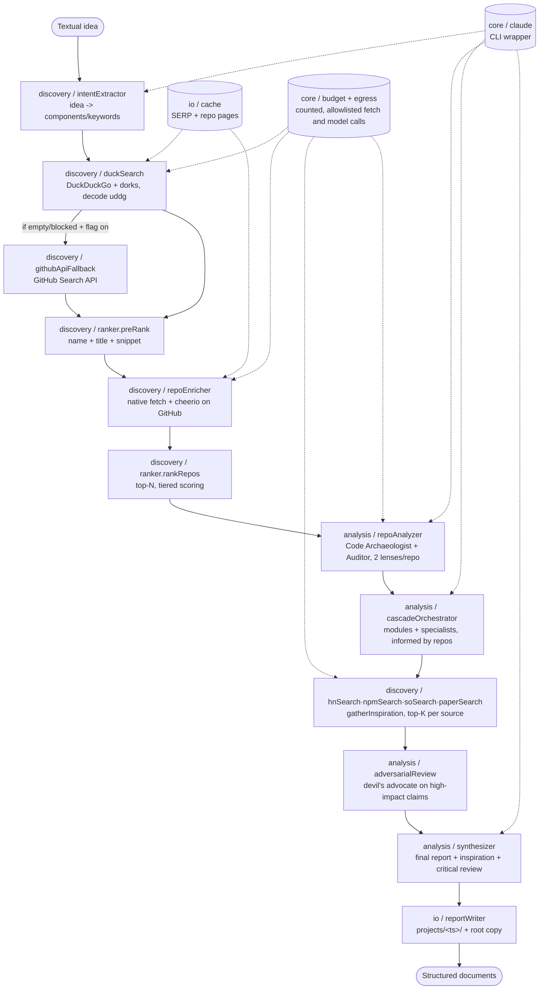
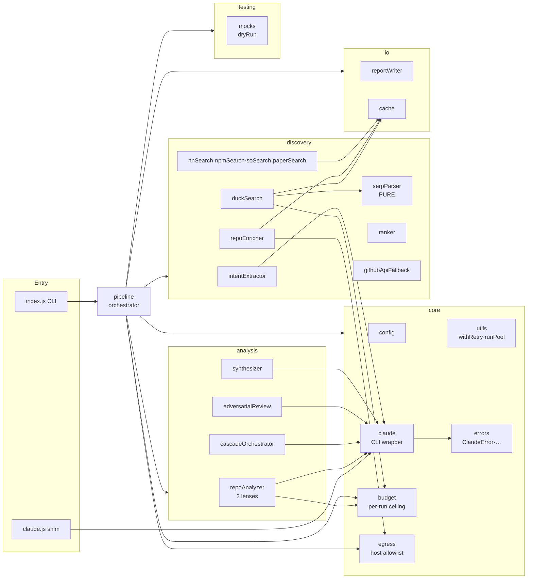

# Architecture - GitResearcher

A Node.js (ESM) tool that turns a textual idea into a set of analysis documents, discovering real
GitHub repositories (via DuckDuckGo + dorks) and analyzing them with specialized analysis agents in a
cascade. Diagrams in [Mermaid](https://mermaid.js.org/) (rendered on GitHub).

## 1. End-to-end pipeline

```mermaid
flowchart TD
    Idea([Textual idea]) --> INTENT[discovery / intentExtractor<br/>idea -> components/keywords]
    INTENT --> SEARCH[discovery / duckSearch<br/>DuckDuckGo + dorks, decode uddg]
    SEARCH -->|if empty/blocked + flag on| FALLBACK[discovery / githubApiFallback<br/>GitHub Search API]
    SEARCH --> PRERANK[discovery / ranker.preRank<br/>name + title + snippet]
    FALLBACK --> PRERANK
    PRERANK --> ENRICH[discovery / repoEnricher<br/>native fetch + cheerio on GitHub]
    ENRICH --> RANK[discovery / ranker.rankRepos<br/>top-N, tiered scoring]
    RANK --> ANALYZE[analysis / repoAnalyzer<br/>Code Archaeologist + Auditor, 2 lenses/repo]
    ANALYZE --> CASCADE[analysis / cascadeOrchestrator<br/>modules + specialists, informed by repos]
    CASCADE --> INSPIRATION[discovery / hnSearch·npmSearch·soSearch·paperSearch<br/>gatherInspiration, top-K per source]
    INSPIRATION --> REVIEW[analysis / adversarialReview<br/>devil's advocate on high-impact claims]
    REVIEW --> SYNTH[analysis / synthesizer<br/>final report + inspiration + critical review]
    SYNTH --> WRITE[io / reportWriter<br/>projects/&lt;ts&gt;/ + root copy]
    WRITE --> Docs([Structured documents])

    CACHE[(io / cache<br/>SERP + repo pages)] -.-> SEARCH
    CACHE -.-> ENRICH
    CLAUDE[(core / claude<br/>CLI wrapper)] -.-> INTENT
    CLAUDE -.-> ANALYZE
    CLAUDE -.-> CASCADE
    CLAUDE -.-> SYNTH
    GUARD[(core / budget + egress<br/>counted, allowlisted fetch and model calls)] -.-> SEARCH
    GUARD -.-> ENRICH
    GUARD -.-> INSPIRATION
    GUARD -.-> ANALYZE
```

Each phase is isolated: a non-fatal failure saves partials and continues
(`fail non-fatal + save partial` philosophy). `dryRun` injects DI mocks across the whole chain
-> no real calls to Analysis Engine/DuckDuckGo/GitHub.

## 2. Package organization

```mermaid
flowchart LR
    subgraph ENTRY[Entry]
        IDX[index.js CLI]
        SHIM[claude.js shim]
    end
    subgraph CORE[core]
        CFG[config]
        UTL[utils<br/>withRetry·runPool]
        ERR[errors<br/>ClaudeError·…]
        CLD[claude<br/>CLI wrapper]
        BUD[budget<br/>per-run ceiling]
        EGR[egress<br/>host allowlist]
    end
    subgraph DISC[discovery]
        IEX[intentExtractor]
        SP[serpParser<br/>PURE]
        DS[duckSearch]
        RE[repoEnricher]
        RK[ranker]
        GAF[githubApiFallback]
        INSP[hnSearch·npmSearch·soSearch·paperSearch]
    end
    subgraph ANA[analysis]
        RA[repoAnalyzer<br/>2 lenses]
        CO[cascadeOrchestrator]
        ADV[adversarialReview]
        SY[synthesizer]
    end
    subgraph IO[io]
        RW[reportWriter]
        CA[cache]
    end
    subgraph TEST[testing]
        MK[mocks<br/>dryRun]
    end
    PL[pipeline<br/>orchestrator]

    IDX --> PL
    SHIM --> CLD
    PL --> CORE
    PL --> DISC
    PL --> ANA
    PL --> IO
    PL --> TEST
    DS --> SP
    DS --> CA
    RE --> CA
    INSP --> CA
    IEX --> CLD
    RA --> CLD
    CO --> CLD
    ADV --> CLD
    SY --> CLD
    CLD --> ERR
    RE --> EGR
    DS --> BUD
    RA --> BUD
    PL --> BUD
    PL --> EGR
```

**Dependencies point downward** (arrows go from consumers to providers):
`entry -> pipeline -> {core, discovery, analysis, io, testing}`. `core` does not depend on any other
package (foundation). `budget` and `egress` import nothing, and `utils.withRetry` honours a
generic `noRetry` property instead of importing `budget`, so that stays true. No module imports
from `index.js` (no cycles).

## 3. Key contracts (dependency injection)

All modules with I/O accept a `deps = {}` with real defaults; in `dryRun`/tests the pipeline injects
mocks -> testability without network and without mocking ESM.

| Module | Signature (deps) |
|---|---|
| `duckSearch.searchRepos` | `{ fetchImpl?, parseResults?, cache? }` |
| `repoEnricher.enrichRepos` | `{ getPage?, cache? }` |
| `repoAnalyzer.analyzeRepo` | `{ runClaude?, fetchIssues? }` |
| `repoAnalyzer.analyzeRepoWithCritique` | `{ runClaude?, fetchIssues? }` (two parallel lenses) |
| `cascadeOrchestrator.runCascade` | `{ runClaude?, runClaudeJSONWithRetry? }` |
| `discovery/hnSearch·npmSearch·soSearch·paperSearch` | `{ fetchImpl?, topK?, cache? }` (uniform source contract) |
| `pipeline.gatherInspiration` | `{ hn?, npm?, so?, papers? }` (each: a source fn) |
| `adversarialReview.runAdversarialReview` | `{ runClaude? }` |
| `synthesizer.synthesizeReport` | `{ runClaude? }`, `inspiration = {}`, `criticalReview = ''` |
| `discovery/ranker.takePerKeyword` | PURE (no deps) - per-keyword coverage |
| `core/claude.runClaude` | `{ spawn? }` (injectable spawner) |
| `core/budget.createBudget` | `{ maxLlmCalls?, maxHttpRequests? }` -> `countLlm`, `countHttp`, `wrapFetch(fetchImpl)`, `report()` |
| `core/egress.guardFetch` | `(fetchImpl?, hosts = ALLOWED_HOSTS)` -> fetch that rejects an undeclared host |
| `pipeline.buildPhaseDeps` | `(dry, mocks, budget = NOOP_BUDGET)`: composes `budget.wrapFetch(guardFetch())` into every key a module reads |

A refused ceiling (`BudgetExceededError`) and a denied host (`EgressDeniedError`) are decisions,
not faults: every degrading `catch` rethrows them (`rethrowIfBudget`) and `withRetry` does not
retry them. Otherwise a refusal reads as "this source returned nothing".

## 4. Output documents

`projects/<TIMESTAMP>/`: `1_intent_decomposition.json`, `2_repo_candidates.json`,
`3_repo_analysis_<n>_*_<role>.md` (one per lens), `4_module_breakdown.json`, `5_module_analysis_<m>_*.md`,
`6_inspiration.json` (HN/npm/SO/papers), `7_critical_review.md` (adversarial), `final_report.md`
(root copy in real mode only).

## 5. Validation strategy

- `node --check` + **import-smoke** (`scripts/check.mjs`): asserts a module exports the names its
  callers expect, one module per invocation. CI runs it on the core contracts (`config`, `budget`,
  `egress`, `pipeline`) -- the check that would have caught `config.PER_KEYWORD_LIMIT`.
- **Unit tests** (offline, with DI mocks): ranker, serpParser, duckSearch, repoEnricher, claude
  (mock spawn), cache, errors, utils, reportWriter, resume, inspiration sources (hn/npm/so/paper)
  + `formatInspiration` + `gatherInspiration`, budget, egress.
- **Isolation** (`tests/isolation.test.js`): the tests that use the real `.cache` and `projects`
  defaults run inside a temporary working directory, and a guard asserts a real run's data
  survives the suite.
- **Smoke e2e** (`dryRun`): whole pipeline with mocks.
- **Real e2e** (manual): requires an authenticated `claude` CLI (`claude auth status`) and network
  access. No browser: the enricher uses native fetch.
- **Coverage**: 91.7% lines / 83.4% functions / 74.0% branch (2026-09-15, 161 tests), measured over
  `src/` only with
  `node --test --experimental-test-coverage --test-coverage-include="src/**"`. The command is
  quoted because the previous figures (96.2 / 93.2 / 80.7) could not be reproduced by any
  invocation: a coverage number without the command that produced it is not a measurement.
  The residual is real integration code (CLI spawn, real-mode discovery) plus the degraded
  paths that no test exercises.
