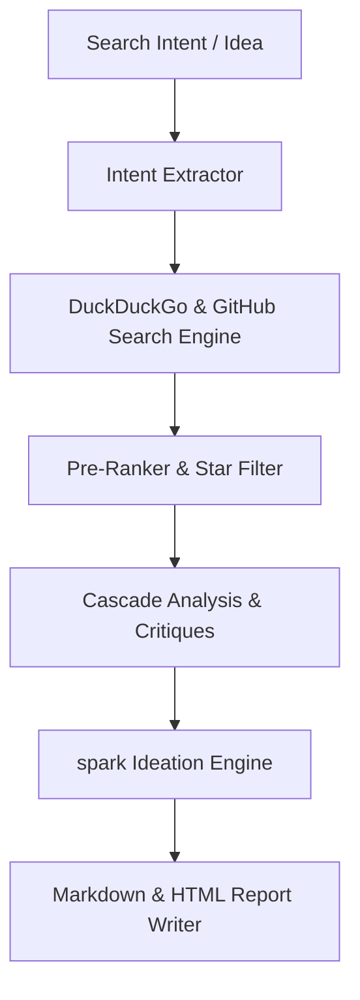

# 📋 GitResearcher Architectural Planning & Design Spec

## 1. Overview
`git-researcher` is a multi-agent discovery and cascade analysis pipeline designed to research, analyze, and rank open-source repositories from GitHub, HuggingFace, arXiv, and developer communities.

---

## 2. Pipeline Stages

### Stage 1: Intent Extraction & Search
Extracts search intents, dorks, and query terms to search GitHub repositories, StackOverflow, arXiv papers, and NPM packages.

### Stage 2: Pre-Ranking & Enrichment
Sorts discovered repositories by star counts, activity freshness, and minimum star thresholds.

### Stage 3: Cascade Analysis & Spark Ideation
Applies multi-lens code critiques, adversarial reviews, and integrates the `spark` 4-lens lateral ideation engine.

### Stage 4: Markdown & HTML Dashboard Exporter
Persists findings into human-readable Markdown reports and interactive HTML dashboards.
