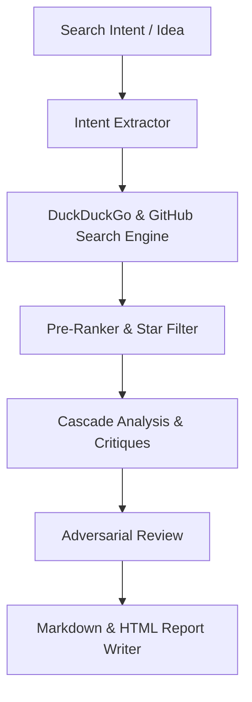

# 📋 GitResearcher Architectural Planning & Design Spec

## 1. Overview
`git-researcher` is a multi-agent discovery and cascade analysis pipeline designed to research, analyze, and rank open-source repositories from GitHub, HuggingFace, arXiv, and developer communities.

---

## 2. Pipeline Stages

### Stage 1: Intent Extraction & Search
Extracts search intents, dorks, and query terms to search GitHub repositories, StackOverflow, arXiv papers, and NPM packages.

### Stage 2: Pre-Ranking & Enrichment
Sorts discovered repositories by star counts, activity freshness, and minimum star thresholds.

### Stage 3: Cascade Analysis & Adversarial Review
Applies multi-lens code critiques (Archaeologist + Auditor per repo, specialists per module),
then a single devil's-advocate pass over the result before synthesis.

This stage once claimed to integrate the `spark` 4-lens ideation engine. It never did:
`sparkIntegrator.js` was imported by nothing, and when the spark script was absent it
resolved with a hardcoded "blueprint" instead of failing. It has been removed rather
than wired, because a stage that invents its own output on failure is worse than a
missing stage.

### Stage 4: Markdown & HTML Dashboard Exporter
Persists findings into human-readable Markdown reports and interactive HTML dashboards.
